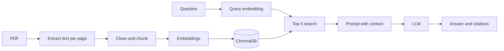

# AI Document Intelligence System

A RAG application for asking questions about PDF documents. Answers are returned with source citations, and the system replies "insufficient information" when the answer is not present in the documents.

**Stack:** FastAPI, LangChain, OpenAI, ChromaDB, PyMuPDF

## Architecture



**Upload flow:** Text is extracted page by page, cleaned, split into chunks, embedded, and stored in ChromaDB. Each chunk keeps its file name, page number, and chunk ID.

**Question flow:** The question is embedded and the 5 most similar chunks are retrieved. They are placed in a prompt that restricts the model to the provided context, and the answer is returned with citations.

## Setup

Python <version>

```
python -m venv venv
venv\Scripts\activate
pip install -r requirements.txt
```

Copy `.env.example` to `.env`, add the OpenAI API key, then start the server:

```
fastapi dev app/main.py
```

Swagger UI: http://127.0.0.1:8000/docs

## Environment Variables

| Name | Default | Purpose |
|---|---|---|
| OPENAI_API_KEY | none | OpenAI API key (required) |
| EMBEDDING_MODEL | text-embedding-3-small | Embedding model |
| LLM_MODEL | gpt-4o-mini | Chat model |
| CHROMA_DIR | chroma_db | Vector store folder |
| CHUNK_SIZE | 500 | Characters per chunk |
| CHUNK_OVERLAP | 100 | Overlap between chunks |
| TOP_K | 5 | Chunks retrieved per question |

## API

**POST /upload**: accepts a PDF (form field `file`) and returns the number of chunks stored. Re-uploading a file with the same name replaces its earlier chunks. Errors: 400 for invalid, empty, or text-less files; 503 for storage failures.
```json
{"file_name": "test-doc-ai-doc-intelligence.pdf", "chunks_stored": <number>}
```

**POST /ask**: accepts a question and returns an answer with citations. Errors: 400 for an empty question; 503 for LLM or vector store failures.
```json
{"question": "How many days per week can an eligible employee work remotely?"}
```
```json
{
  "answer": "Eligible employees may work remotely for up to three days per week.",
  "citations": [
    {"file_name": "test-doc-ai-doc-intelligence.pdf", "page_number": 1, "chunk_id": "test-doc-ai-doc-intelligence.pdf_p1_c2"}
  ]
}
```

**GET /health**: returns API key status, vector store status, and the number of indexed chunks.

